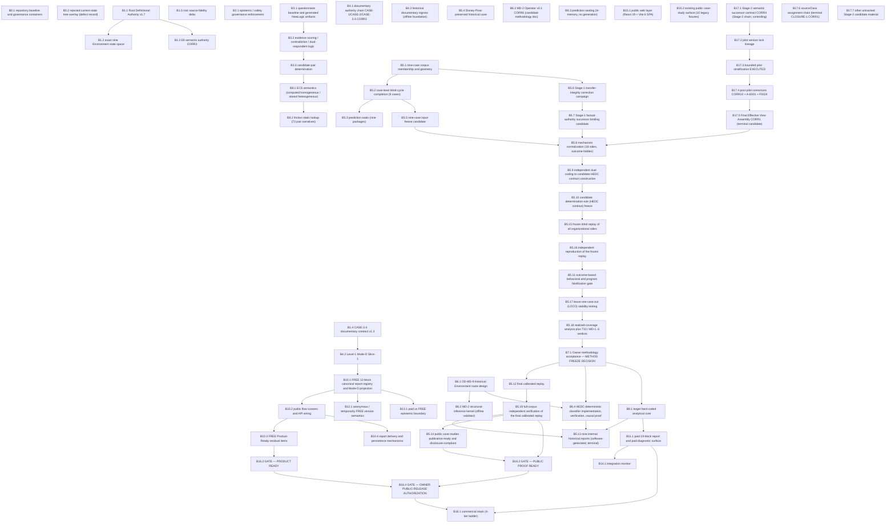

# MERGEVUE M&A — VERIFIED CURRENT CONTROL TREE — RECONSTRUCTION CANDIDATE **CORR4**

**Act:** `MERGEVUE_VERIFIED_CURRENT_CONTROL_TREE_RECONSTRUCTION_1.CORR4`
**Date:** 2026-10-08
**Author:** Z.ai (GLM-5.3 Flash via ZCode), Owner-assigned AUTHOR; local Git restricted to artifact creation
**Corrects:** `MERGEVUE_VERIFIED_CURRENT_CONTROL_TREE_RECONSTRUCTION_1.CORR3` (63-node candidate) — **FAILED Codex IV4: 0 BLOCKING / 1 MAJOR / 2 MINOR** (IV4-M01 hidden ASCII dependency `B7.1 → B5.19`; IV4-N02 B5.8 governance overclaim; IV4-N03 generator/matrix provenance staleness). Correction ledger: `MERGEVUE_CORRECTION_LEDGER.md` in this directory. Chain: Reconstruction-1 → CORR1 → CORR2 → CORR3 → **CORR4** (direct parent = CORR3).
**Independent auditor of record for this candidate:** Codex (IV5 — targeted to the three IV4 findings, package integrity and no-regression verification; not yet performed)
**Status:** `CANDIDATE / NOT CONTROLLING GOVERNANCE`. This document is act-local candidate material under `WORKBENCH/AUDITS/`. It is **not** authority. It does not supersede `docs/governance/MERGEVUE_CONTROL_TREE_v2.1_2026-09-04.md`, the Report-Product Addendum, or any accepted addendum. No self-verification and no Owner acceptance is claimed.
**Provenance note (IV4 report):** the Codex IV4 report's physical bytes were **not located** in the workspace (searched: repo, external Workbench, paste-attachment area, home Downloads, wider project tree — the only on-disk "IV4" files belong to a different project's Stage-2 chain). This correction is executed from the **Owner task's complete transcription** of the three findings (verdict, finding IDs, exact correction mandates, exact values), which is the current explicit Owner instruction and the controlling act definition. Each finding was independently re-verified against primary sources before correction (ledger §P-cover; E55; HOLD-9).

---

## 0. Baseline and method

| Item | Value | How established |
|---|---|---|
| Repository | `Inposibl/mergevue` (`git remote -v`) | live read (Reconstruction-1) |
| Local `main` HEAD | `ee55034f5b40dadffc59aa3b842eb9b69157df68` — re-checked unchanged at CORR4 authoring time | `git rev-parse HEAD` |
| HEAD tree identity | `ed3b9b6d7cca3ebfb067d545d9e7f886bdfcc180`, byte-equal to the `3d7b777` tree | rollback manifest (Reconstruction-1, carried) |
| Tracked worktree | clean; untracked paths are Workbench/candidate material; this act adds only the CORR4 directory | `git status --porcelain` |
| Method | Strictly bounded documentary correction of exactly three IV4 findings. The matrix is the candidate's authoritative graph representation; the §21 diagram is a **full-view** Mermaid rendering whose declared edge set **equals** the matrix's 52 direct dependencies, mechanically validated by the generator (mermaid edges + edge-manifest + declared adjacency + independent report transcription). All prior SHA-256 and corpus identities are preserved; every identity re-pinned "this act" was recomputed from physical bytes. No methodology was reinterpreted and no matrix dependency was changed (regression constraint). | this act |

### 0.1 Status dimensions (mandatory — no single completion symbol)

Per Control Tree v2.1 §0 and Git Worktree Closure Governance §21, every node carries **independent dimensions**; a value in one dimension never implies another.

| Tag | Dimension | Vocabulary |
|---|---|---|
| **G** | Governance | `OWNER_ACCEPTED` (and scoped variants) · `OWNER_ACCEPTANCE_NOT_ESTABLISHED` (IV2-M02) · `CANDIDATE` · `NOT_REACHED` · `UNKNOWN` |
| **IV** | Independent verification (non-author) | `PASS` · `FAIL` · `NOT_RUN` · `NOT_ESTABLISHED` |
| **B** | Git binding | `BOUND@<commit>` · `BOUND` · `UNTRACKED` · `REVERTED@<commit>` · `N/A` |
| **C** | Implementation (tracked code) | `COMPLETE` · `PARTIAL` · `ABSENT` · `N/A` |
| **R** | Runtime integration | `INTEGRATED_CODE_PATH` (wired into the served product path; **not** a claim of deployed success) · `OFFLINE_VALIDATED_ONLY` · `NOT_ESTABLISHED` · `ABSENT` · `N/A` |
| **DEP** | Exact blocking predecessor | node id(s) |
| **EV** | Evidence | `MERGEVUE_EVIDENCE_INDEX.json` |

**`NOT_ESTABLISHED` semantics (IV1-M07).** `NOT ESTABLISHED` means the evidence was **searched for and not found** within the act's scope. It is a missing-evidence marker. Failed retrieval is **never** converted into `NOT_RUN` (a positive claim that nothing ran), current rejection, or current closure. Applied to B5.8 by IV3-N02: absence of a located execution record is **not** proof that an act never ran, and a filename census never proves or disproves execution.

**Authoring-time vs current (IV4-N02).** A statement inside a bound document (e.g. `STAGE_2_STARTED = NO`, Stage-1 successor-binding doc :399, dated 2026-09-25) fixes what its authoring act recorded **on its authoring date**. It is never converted into a claim about current authorization, execution, or governance status on a later date. Where independently sufficient current Owner/governance evidence is not located, current governance is **`UNKNOWN`**. A negative file search or an unresolved predecessor blocks authorized forward progression; neither proves that a stage was never executed.

**`OWNER_ACCEPTANCE_NOT_ESTABLISHED` semantics (IV2-M02, carried).** An acceptance **attestation** exists in the record, but the exact Owner-acceptance evidence was searched for and not located. The value preserves — never erases — a verified IV result or Git binding carried by the other dimensions of the same node.

---

## 1. BRANCH 0 — BASELINE AND GOVERNANCE CONTAINERS

- **Control Tree v2.1** — G:`OWNER_ACCEPTED` · IV:`PASS` (per v2.1 self-record) · B:`BOUND@7792c5e` · SHA-256 `360bafa29bad…f7128` recomputed this act, matches sidecar. No later Control Tree version exists in the repository.
- **Accepted governance addenda (sidecars recomputed OK; RP pair re-verified again this act):** Report-Product Addendum `83cdd1ec…815` (2026-09-21); Report Product Authority v1.0 `e52029d9…f33` (2026-09-21); 9-Case Corpus Addendum `fb602181…` (bound `d177386`); Outcome-IV Durable Authority Binding `568b5164…` (bound `6ad8933`); Stage-1 Successor Binding `be9593a7…0237` (bound `92236dc`; re-verified this act); Git Worktree Closure Governance `27aa43ab…`; Model Routing Policy `07fdf430…`; Commercial North Star v1.2 `d10366db…`; Public Case-Study Authority `88524e20…`; Public Case-Study Disclosure Contract Authority `6bb36762…`; Post-10 Recalibration Track `3adf1fbd…`; Post-Free Engineering Optimization Track `dd9fb891…`; Calibration Pre-Remaining-Corpus Authority `3d0d593a…`; Tree-Model Need-First Guardrail `93484e46…`.
- **Binding-commit ancestry:** `7792c5e`, `cb8f890`, `d177386`, `6ad8933`, `d52e7f4`, `f9fa210`, `92236dc`, `31fd56e`, `d14f197`, `2567223`, `9b1545e`, `fcbcf86`, `3d7b777` — verified ancestors of HEAD in Reconstruction-1; unchanged by any later commit (HEAD identical).
- **Rejected overlay rollback — MATRIX NODE B0.2:** commits `c7a83a3` → `21ce98f` → `4f75669` were rejected and reverted at `ee55034`; archive ref `refs/archive/MERGEVUE_REJECTED_TREE_COMMITS_ROLLBACK_1` → `21ce98f`. Narrative Branch 18 **is** matrix node `B0.2` (IV1-N01); no node exists outside the B0–B17 matrix branches.

## 2. BRANCH 1 — ROOT THEORY / DEFINITIONAL AUTHORITY

- **Root Definitional Authority v1.7** — G:`OWNER_ACCEPTED` · IV:`PASS` · B:`BOUND@7792c5e` · v1.7 archive SHA `8decabd692e1…c4ccdf` recomputed in Reconstruction-1 == v2.1 pin. Documentation debt (v2.1 §1): the re-verification report file's own SHA is not bound (HOLD-7).
- **Exact nine Environment state space (R1 26 / R2 14 / R3 10 / R4 9)** — G:`OWNER_ACCEPTED` · C:`COMPLETE` · R:`INTEGRATED_CODE_PATH`.
- **E9 semantic authority CORR3** — G:`OWNER_ACCEPTED` · B:`BOUND@cb8f890`.
- **CASE-3.4 contract v1.3** — G:`ACCEPTED_BY_OWNER_DESIGNATED_USE` · SHA `dae8143899cd…ae39` recomputed == v2.1 pin.
- **Root source-fidelity delta** — G:`CANDIDATE`/open, unchanged from v2.1.

## 3. BRANCH 2 — EPISTEMIC / SAFETY GOVERNANCE

- G:`OWNER_ACCEPTED` · IV:`PASS` per v2.1 · C:`PARTIAL` · R:`OFFLINE_VALIDATED_ONLY` — validator enforcement exists in tracked code; production-scope runtime enforcement not independently proven. EV: `MERGEVUE_CAUSALITY_PROOF_AND_AGENT_CONTROL.md`; `scripts/validate-md2-offline.mjs` (`environmentBinding=="NONE"` asserted at :196/:346/:1229).

## 4. BRANCH 3 — LIVE RESPONDENT / QUESTIONNAIRE SYSTEM

- Questionnaire baseline and generated NewLogic artifacts: `COMPLETE` / `INTEGRATED_CODE_PATH`.
- Evidence scoring / contradiction / dual-respondent logic: `COMPLETE` / `INTEGRATED_CODE_PATH`.
- **Candidate-pair determination (B3.3) — IV1-M04 semantics + IV2-N01 corrected citations (carried):** bounded selector over **Acquirer-respondent hypothesis candidates** (`candidatePairSelector.js:29-30` constants; `REACHABLE_CANDIDATE_PAIRS` (4) :36-41; `VALID_PAIR_WHITELIST` (5) :45-51; fail-closed `NO_LAWFUL_PAIR` :662 / `PAIR_SELECTION_AMBIGUOUS` :673 / `SELECTED` :685). The four pairs are **not** a model of the universe of M&A transaction pairs; dynamic pair determination is not operational — `C:PARTIAL`.

## 5. BRANCH 4 — DOCUMENTARY EVIDENCE SYSTEM

- CASE-1/CASE-2/CASE-3.4.CORR3 chain — Owner-accepted (v2.1 §4).
- **Level-1 Mode-D Slice-1** — C:`COMPLETE` for declared scope; R:`INTEGRATED_CODE_PATH` (live `data.sec.gov` retrieval wired); live-SEC runtime from the deployment environment: `NOT_ESTABLISHED`.
- **Historical documentary ingress (B4.3) — carried:** offline semantic-control foundation implemented in tracked code (`src/historical/`); offline-validated only (validator re-run in CORR2: **215/215 PASS**); zero network calls; automated external-archive collector and production ingress ABSENT — neither claimed.

## 6. BRANCH 5 — HISTORICAL CALIBRATION PROGRAM (9 active cases / 18 sides)

### 6.1 Corpus membership and geometry
- G:`OWNER_ACCEPTED` (9-Case Addendum, bound `d177386`; Owner verbatim acceptance bound in `6ad8933`) · IV of the addendum governance bytes themselves: `NOT_ESTABLISHED`. Geometry: 9 transactions / 18 sides; disney-pixar `PRESERVED_HISTORICAL_CASE` + `EXCLUDED_FROM_METHODOLOGY_CALIBRATION_CORPUS`.

### 6.2 Research-cycle completion (case level)
- G:`OWNER_ACCEPTED` — `ALL_9_ACTIVE_CASES_HAVE_COMPLETED_REQUIRED_CASE_LEVEL_BLIND_CYCLE_LAYERS = YES` (bound `6ad8933`); outcome IVs recorded Owner-accepted at exact identities. Per-case package identities: carried authority, not re-hashed (HOLD-4).
- **Prediction seals** — physically present per case; case-seal package identities carried (HOLD-4). The **product-side** sealing mechanism semantics are node B8.3.

### 6.3 Nine-case input-freeze candidate (B5.5)
- G:`CANDIDATE` · **IV:`NOT_ESTABLISHED`** · B:`BOUND@d52e7f4`. Own bytes: `READY_FOR_INDEPENDENT_VERIFICATION` / `OWNER_ACCEPTED: NO` / `CORPUS_FREEZE_FINAL: NO` (SHA `da9b9de2…3cbd6`, re-verified this act). Candidate-specific IV and Owner acceptance searched (re-searched in CORR2/CORR3, negative) and not found. Binding-before-lifecycle anomaly preserved. INPUT freeze — distinct from the candidate determination-**rule** freeze B5.10.

### 6.4 Stage-1 transfer-integrity correction campaign (B5.6)
- G:`OWNER_ACCEPTED` · IV:`PASS`. Exact acceptance locus: bound successor-binding doc §2.2. 905/905 facts, DC-001…019 corrected. HOLD-2 stands. **Distinct instrument from the B5.7 successor-binding candidate.**

### 6.5 Stage-1 factual-authority successor binding (B5.7) — four-layer lifecycle (IV2-P03, carried)
- G:`CANDIDATE` · **IV:`NOT_ESTABLISHED`** · B:`BOUND@92236dc` (SHA `be9593a7…0237`, re-verified this act).
- (1) **Authoring-time candidate statement** (bound bytes :404-413): `STAGE1_CLOSURE_READY=YES` / `STAGE1_CLOSED=NO` — preserved verbatim as historical wording. (2) **Physical Git binding:** `92236dc`. (3) **Later agent-reported closure assertions** (preserved, never authority): Reality Audit :28-30; Grok 2026-09-26 document :59 (referenced Owner instruction not located). (4) **Currently verified lifecycle:** **`NOT_ESTABLISHED`** — no candidate-specific IV and no exact Owner-acceptance record located; `STAGE1_CLOSED = YES` occurs in no artifact. **Current closure: `NOT_ESTABLISHED`. Exact-byte Owner acceptance: `NOT_ESTABLISHED`.** The campaign/candidate "conflation" explanation remains an **INFERENCE**. Binding-before-lifecycle anomaly preserved.

### 6.6 Calibration analytical chain — controlling sequence (IV2-M01, carried unchanged)
Mechanism normalization (B5.8) → dual coding + candidate HEDC contract construction (B5.9) → candidate rule freeze before replay (B5.10, track §12) → frozen blind replay (B5.15, §13) → independent reproduction (B5.16) → outcome-based falsification (B5.11, v2.1 §5.8) → LOCO (B5.17) → realized coverage + T10/MD verdicts (B5.18) → Owner methodology acceptance (B7.1, v2.1 §7 = track §21) → final calibrated replay (B5.12, §22) → full-corpus independent verification (B5.19, §23); then B5.13 (reports) and B5.14 (public case studies) hang off the verified replay. Ordering generator-enforced; unchanged by this act.

**Reading rule for this section (IV4-N02).** B5.8's entry below carries the five distinct layers mandated by IV4-N02 (authoring-time historical state; current authorization/governance; current execution evidence; current independent-verification evidence; eligibility to proceed under controlling dependencies). The `NOT_REACHED` values of the downstream items (2–13) are lifecycle **positions under the Owner-accepted controlling sequence** (IV2-M01, carried; generator-enforced ordering); they assert the accepted order of gates, **not** an execution-history claim about any Stage-2 analytical act — execution-history questions are `NOT_ESTABLISHED`-class missing-evidence markers, never derived from negative searches or from B5.8's disambiguated state.

1. **Mechanism normalization** (B5.8) — 18 sides, outcome-hidden. **IV4-N02 corrected representation — five distinct layers; no layer implies another:**
   - (i) **Historical stage state at document authoring:** the bound successor-doc bytes record `STAGE_2_STARTED = NO` (:399; SHA `be9593a7…0237`, bound `92236dc`, dated 2026-09-25) — a line in that act's own authoring-time terminal checklist. It fixes the record as of 2026-09-25 only and does **not** establish current execution or governance status on 2026-10-08.
   - (ii) **Current authorization / governance:** **`UNKNOWN`** — no independently sufficient current Owner/governance evidence demonstrating a more specific state was located. The former current `NOT_REACHED` claim is **withdrawn** (IV4-N02): it was derived from the authoring-time record, negative file searches, and unresolved predecessors, none of which establishes current governance.
   - (iii) **Current execution evidence:** `NOT_ESTABLISHED` (IV3-N02 basis carried) — the act-specific execution record was searched (act-name filenames; content tokens; the 22 uppercase / 26 case-insensitive `*MECHANISM*` census matches are Stage-1 per-case research products, re-census re-run this act with identical counts) and not found. Absence of record is a missing-evidence marker, never proof that the act never ran.
   - (iv) **Current independent-verification evidence:** `NOT_ESTABLISHED`.
   - (v) **Eligibility to proceed under controlling dependencies:** B5.8 is **not cleared for authorized forward progression** under the accepted controlling sequence while its blocking predecessors (B5.5, B5.7, B17.5) remain lifecycle-unresolved/unbound. This is a forward-progression statement only: **a stage blocked from authorized future progression is not thereby proven never to have executed.**
   - Dimensions: IV:`NOT_ESTABLISHED` (preserved) · C:`ABSENT` **scoped to tracked-code inspection** (grep `normalizeMechanism|mechanismNormal|normalizationStage|outcomeHidden`: 0 hits in `src/ api/ scripts/`, re-run this act) · R:`ABSENT` on the same code-level scope. No `OWNER_AUTHORIZED`, `OWNER_ACCEPTED`, or completed-execution inference is made. DEP: B5.7, B5.5, B17.5.
2. **Independent dual coding → candidate HEDC determination-contract construction** (B5.9) — candidate HEDC derivation for falsifiable tests happens here; distinct from post-acceptance deterministic implementation (B6.4). `NOT_REACHED` (lifecycle position, see reading rule above). DEP: B5.8.
3. **Candidate determination-rule (HEDC contract) freeze — physical freeze before replay** (B5.10) — track §12. `NOT_REACHED`. DEP: B5.9.
4. **Frozen blind replay of all organizational sides** (B5.15) — track §13/§28. `NOT_REACHED`. DEP: B5.10.
5. **Independent reproduction of the frozen blind replay** (B5.16) — track §28 + §25 Layer 2. `NOT_REACHED`. DEP: B5.15.
6. **Outcome-based behavioral & program falsification gate** (B5.11) — v2.1 §5.8; track §28 ordering. `NOT_REACHED`. DEP: B5.16.
7. **Leave-one-case-out (LOCO) stability testing** (B5.17) — track §28 + §30 step 9. `NOT_REACHED`. DEP: B5.11.
8. **Realized-coverage analysis + separate T10 / MD-1…MD-6 verdicts** (B5.18) — track §28 + §29 + §30. `NOT_REACHED`. DEP: B5.17.
9. **Owner methodology acceptance — METHOD FREEZE DECISION** (B7.1) — v2.1 §7 = track §21. `NOT_REACHED`. DEP: B5.18.
10. **Final calibrated replay** (B5.12) — v2.1 §5.9 + track §22. `NOT_REACHED`. DEP: B7.1.
11. **Full-corpus independent verification of the final calibrated replay** (B5.19) — track §23/§24. `NOT_REACHED`. DEP: B5.12.
12. **Nine internal historical reports** (B5.13) — software-generated; requires verified replay + verified classifier + verified core (P02 ancestry, generator-enforced). `NOT_REACHED`. DEP: B5.19, B6.4, B9.1.
13. **Public case studies publication-ready + disclosure-contract compliance** (B5.14) — track §23/§24/§27. `NOT_REACHED`. DEP: B5.19.

### 6.7 Report-generation prerequisites (IV2-P02, carried)
B5.13's dependency ancestry requires the verified final calibrated replay (B5.19→B5.12→B7.1), the accepted-HEDC verified deterministic classifier implementation (B6.4), and the independently verified analytical core (B9.1) — v2.1 §7 conversion chain. Completed replay alone does not enable software-generated reports (`md2.js:963` `environmentBinding="NONE"`, re-read this act).

## 7. BRANCH 6 — HISTORICAL ENVIRONMENT ROUTE (OD-MS-9 / MD-2 / HEDC)

- OD-MS-9 design: owner-authorized direction; full methodology audit `NOT_RUN` (unchanged).
- MD-2 kernel: `environmentBinding="NONE"` hardcoded (`src/historical/md2.js:963`, re-read this act); offline-validated only; excluded from the product path by design.
- MD-2 Operator v0.1 CORR6: untracked candidate methodology evidence (SHA `02b7691…f5ba` re-verified this act), no sidecar — not bound authority.
- **HEDC (B6.4):** candidate HEDC derivation for falsifiable tests = B5.9; B6.4 = post-acceptance deterministic classifier implementation → independent implementation verification → causal-integration proof (v2.1 §7). 0 code hits today (re-grepped in CORR3; `src/ api/ scripts/` unchanged since — baseline tree identical). DEP: B7.1, B6.1.

## 8. BRANCH 7 — OWNER METHODOLOGY ACCEPTANCE / METHOD FREEZE (B7.1)

G:`NOT_REACHED` · DEP: B5.18. Owner decision: FULL / PARTIAL-TIERED / REJECT-REDESIGN (v2.1 §7); identical to track §21. v2.1 §5.8 gate outcomes map onto the §7 branches. The multi-agent research process must not become the production engine.

## 9. BRANCH 8 — EXISTING HARD-CORE FOUNDATIONS

- **ECS (B8.1) — IV1-M04 semantics; IV3-N01 corrected citation.** Two distinct mechanisms:
  - **Homogeneous branch** (acquirer code == target code): ECS is **computed** — the homogeneous branch condition `if (acquirerEnvironmentCode === targetEnvironmentCode)` is at **`finalDeliverableFlow.js:886`** (IV3-N01; CORR2's `:879` was wrong — line 879 is the unrelated `"environment-pair-incomplete"` early-return string, a different meaning and not re-pointed blindly), and `canonicalStructuralEcs` is **computed at :893** (`:378-404` definition; formula `ECS = 100 × (1 − C/34)` over the static 17×9 `RESOURCE_PRIORITY_MATRIX` :84; a same-environment pair yields C = 0 → ECS = 100 **mechanically** — governed-parameter comment "no transaction literal", :344-352, OD-RMP3 chain).
  - **Heterogeneous branch**: ECS is a **stored lookup** at **`:955`**: `score = friction?.ecs ?? narrative?.ecs` from the generated pair tables (`:309-310`; finders :330/:334).
  Static friction (B8.2) and the static resource matrix facts are preserved unchanged. **ECS mathematical semantics untouched.**
- **Prediction sealing (B8.3) — carried:** seal hash = SHA-256 over canonical JSON of exactly `{acquirerEnvironmentCode, targetEnvironmentCode, anchors[3], sealedAt}`; prediction texts and falsification condition outside the preimage; in-memory ledger; no generation; no code modified.

## 10. BRANCH 9 — TARGET HARD-CODED ANALYTICAL CORE

G:`NOT_REACHED` · ABSENT from code (v2.1 §9). DEP: B7.1. Parallel child of the Owner methodology-acceptance gate alongside B6.4; B5.13's ancestry requires both.

## 11. BRANCH 10 — FREE MARKET LAUNCH / PRODUCT READY TRACK (12-block FREE report)

- Governance: Report Product Authority v1.0 + Addendum (both sidecar-verified this act).
- Implementation: the bounded Mode-D public slice is `COMPLETE` — Block 1 `LIMITED` (:447-450); Blocks 2–8 `INSUFFICIENT_PUBLIC_EVIDENCE` (:461-467, literal :258); Block 9 `NOT_APPLICABLE` (:470); Block 10 `LIMITED` (:480); Blocks 11–12 `AVAILABLE` (:503/:514); 12-block assert (:385). These are **evidence-availability states** emitted without any tier/entitlement input (IV2-P04, carried).
- **Report delivery (B10.4) — carried:** real authorized-PDF→Resend chain wired with five implemented rejection paths; **deployed delivery success `NOT_ESTABLISHED`** (HOLD-5).
- Remaining Product-Ready residuals (B10.3): unchanged from CORR2 (release alignment incl. the unadjudicated Blocks 7–10 ceiling alignment question, leak removal, e2e validation, UX, deploy package, publication-ready nine-case proof content). DEP chain ends at the **PRODUCT READY gate (B16.2)**.

## 12. BRANCH 11 — PAID DEAL DIAGNOSTIC (19-block)

G:`OWNER_ACCEPTED_ARCHITECTURE_ONLY` · C:`ABSENT` · all §11 sub-items `NOT_REACHED`.

## 13. BRANCH 12 — (ANONYMOUS/TEMPORARILY) FREE VERSION

G:`OWNER_ACCEPTED` semantics · C:`PARTIAL` · R:`INTEGRATED_CODE_PATH` for the anonymous slice. Canonical Blocks 7–10 `LIMITED` ceiling requirement verified from authority text (:213/:696); implemented Mode-D emission alignment `NOT_ESTABLISHED`, unadjudicated (IV2-P04, carried).

## 14. BRANCH 13 — PAID vs FREE EPISTEMIC BOUNDARY (B13.1) — carried

G:`OWNER_ACCEPTED` · C:`PARTIAL` · R:`INTEGRATED_CODE_PATH` for the Mode-D surface. Implemented and retained: block registry, bounded availability states, 12-block assert, absence-claim/ECS leak guards, safe-assert. **RP-5 tier-sensitive entitlement/display-ceiling enforcement: `NOT_ESTABLISHED`** (no tier-sensitive implementation demonstrated; projection output invariant to hypothesized tier fields). Full per-control mapping in §20. Unchanged by this act.

## 15. BRANCH 14 — INTEGRATION MONITOR

C:`ABSENT` (0 hits). G:`NOT_REACHED`.

## 16. BRANCH 15 — PUBLIC LAYER (WEB / UI)

- Public web layer (B15.1): React 19 + Vite 6 SPA; deployed UI `NOT_ESTABLISHED`.
- **Existing public case-study surface (B15.2) — carried:** routes, renderers and 10 frozen legacy fixtures exist in code; fixtures are legacy marketing renderings (historical renderings, not canonical values); existence ≠ accepted nine-case public proof (`NOT_REACHED`, B5.14/B16.3); deployed exposure `NOT_ESTABLISHED`.

## 17. BRANCH 16 — COMMERCIAL STACK + LAUNCH GATES

- Ladder semantics (B16.1): Owner-accepted; implementation ABSENT; FREE rung activation gated by B16.4. DEP: B11.1, B16.4.
- **B16.2 — PRODUCT READY** (v2.1 §10.2) — DEP: B10.3.
- **B16.3 — PUBLIC PROOF READY** (v2.1 §10.3) — DEP: **B5.14, B5.19** (exact matrix deps; verified replay required).
- **B16.4 — OWNER PUBLIC-RELEASE AUTHORIZATION / FREE LAUNCH GATE** (v2.1 §10.4) — DEP: B16.2, B16.3. Exclusive Owner act.

## 18. BRANCH 17 — STAGE-2 ANALYTICAL SUCCESSION (matrix ids authoritative; carried)

| Node | G | IV | B |
|---|---|---|---|
| **B17.1** Stage-2 semantic successor contract CORR4 — Stage-2 chain (controlling; distinct from this act's name) | `OWNER_ACCEPTED` | `PASS` (IV5) | `BOUND@2567223` |
| **B17.2** Pilot version lock lineage | `OWNER_AUTHORIZED` | `PASS` | `BOUND@d14f197`, `BOUND@2567223` |
| **B17.3** Pilot stratification EXECUTED | `OWNER_AUTHORIZED` | `NOT_ESTABLISHED` | `UNTRACKED` |
| **B17.4** Post-pilot corrections CORR10+A-E001+F0024 | **`OWNER_ACCEPTANCE_NOT_ESTABLISHED`** | `PASS` ×3 (exact report bytes/SHAs) | `BOUND@9b1545e/3d7b777/fcbcf86` |
| **B17.5** FEVA CORR1 — terminal candidate | `CANDIDATE` | `NOT_RUN` | `UNTRACKED` (records SHA `3603c316…`, 116 records, re-verified this act) |
| **B17.6** sourceClass chain | `OWNER_ACCEPTED_RESIDUALS` | `PASS` | `BOUND@31fd56e` |
| **B17.7** Other untracked material | `CANDIDATE` | `NOT_ESTABLISHED` | `UNTRACKED` |

## 19. NARRATIVE BRANCH 18 → MATRIX NODE B0.2 (no separate branch)

Branch 18 is matrix node `B0.2` (IV1-N01). No node exists outside the B0–B17 matrix branches.

## 20. REPORT-PRODUCT CONTROL RECONCILIATION — RP-1 … RP-13 (IV1-M06; RP-5 per IV2-P04; carried)

All thirteen invariants Owner-accepted; per-control implementation dispositions unchanged from CORR2: RP-5 = Partial (leak guards implemented; **tier-sensitive entitlement/display-ceiling enforcement `NOT_ESTABLISHED`**); RP-8/RP-9/RP-10/RP-11/RP-12 absent as implementation; RP-1–RP-4/RP-13 partial on the Mode-D slice; RP-6/RP-7 no dedicated surface; remaining §1 families (report lifecycle, expert/assurance, secondary-use, forecast accountability) governance-accepted and not implemented; the three not-implemented implementation families open. Evidence-availability statuses distinct from entitlement ceilings. See the CORR2 ledger and matrix B13.1 for the full table (carried byte-identically into this CORR4 matrix).

## 21. DEPENDENCY GRAPH — FULL VIEW, ALL 52 DIRECT EDGES (IV3-M01 + IV4-M01 corrected)

**Legend:** arrows point **from prerequisite to dependent** (`A --> B` means *B depends on A* — the direction of the matrix `dependencies` field). **Full view:** unlike the CORR1–CORR3 partial ASCII views, **every one of the matrix's 52 direct dependencies is drawn exactly once**; the drawn edge set is asserted **equal** to the matrix edge set (not merely a subset), and all 63 nodes are declared.

**IV4-M01 correction record:** the CORR3 ASCII drawing placed B5.19 on a `|-->` branch of the B7.1 trunk (`|--> B5.19 …`) *in addition to* its real B5.12 chain, visually implying a direct `B7.1 → B5.19` dependency that the matrix does not contain (matrix: `B5.12.dependencies = [B7.1]`, `B5.19.dependencies = [B5.12]`). Because shared vertical trunk branches are structurally ambiguous in static ASCII art, this act **replaces the ASCII drawing** with the representation the mission sanctions for exactly that case: a Mermaid diagram with mechanically comparable declared edges (every edge a single explicit `A --> B` declaration; no trunk art, no shared vertical branches, no implied arrows). **No matrix dependency was altered to match the drawing.** The generator validates four representations against each other and against the matrix: (1) the Mermaid edge declarations, (2) the machine-readable `(edge-manifest: …)` line, (3) the declared per-node adjacency list, and (4) the **independent human-readable edge transcription** in `MERGEVUE_RECONSTRUCTION_REPORT.md` §4A — all four must equal the matrix's 52 direct dependencies.



```text
(edge-manifest: B1.1->B1.2; B1.1->B1.3; B3.1->B3.2; B3.2->B3.3; B1.4->B4.2; B5.1->B5.2; B5.2->B5.3; B5.2->B5.5; B5.1->B5.6; B5.6->B5.7; B5.7->B5.8; B5.5->B5.8; B17.5->B5.8; B5.8->B5.9; B5.9->B5.10; B5.10->B5.15; B5.15->B5.16; B5.16->B5.11; B5.11->B5.17; B5.17->B5.18; B5.18->B7.1; B7.1->B5.12; B5.12->B5.19; B5.19->B5.13; B6.4->B5.13; B9.1->B5.13; B5.19->B5.14; B6.1->B6.2; B7.1->B6.4; B6.1->B6.4; B3.3->B8.1; B8.1->B8.2; B7.1->B9.1; B4.2->B10.1; B10.1->B10.2; B10.2->B10.3; B10.2->B10.4; B9.1->B11.1; B10.1->B12.1; B10.1->B13.1; B11.1->B14.1; B11.1->B16.1; B16.4->B16.1; B10.3->B16.2; B5.14->B16.3; B5.19->B16.3; B16.2->B16.4; B16.3->B16.4; B17.1->B17.2; B17.2->B17.3; B17.3->B17.4; B17.4->B17.5)
```

Declared per-node adjacency (exact matrix `dependencies` of every node; `none` = empty):

```text
B0.1 [deps: none]
B0.2 [deps: none]
B1.1 [deps: none]
B1.2 [deps: B1.1]
B1.3 [deps: B1.1]
B1.4 [deps: none]
B1.5 [deps: none]
B2.1 [deps: none]
B3.1 [deps: none]
B3.2 [deps: B3.1]
B3.3 [deps: B3.2]
B4.1 [deps: none]
B4.2 [deps: B1.4]
B4.3 [deps: none]
B5.1 [deps: none]
B5.2 [deps: B5.1]
B5.3 [deps: B5.2]
B5.4 [deps: none]
B5.5 [deps: B5.2]
B5.6 [deps: B5.1]
B5.7 [deps: B5.6]
B5.8 [deps: B5.7, B5.5, B17.5]
B5.9 [deps: B5.8]
B5.10 [deps: B5.9]
B5.11 [deps: B5.16]
B5.12 [deps: B7.1]
B5.13 [deps: B5.19, B6.4, B9.1]
B5.14 [deps: B5.19]
B5.15 [deps: B5.10]
B5.16 [deps: B5.15]
B5.17 [deps: B5.11]
B5.18 [deps: B5.17]
B5.19 [deps: B5.12]
B6.1 [deps: none]
B6.2 [deps: B6.1]
B6.3 [deps: none]
B6.4 [deps: B7.1, B6.1]
B7.1 [deps: B5.18]
B8.1 [deps: B3.3]
B8.2 [deps: B8.1]
B8.3 [deps: none]
B9.1 [deps: B7.1]
B10.1 [deps: B4.2]
B10.2 [deps: B10.1]
B10.3 [deps: B10.2]
B10.4 [deps: B10.2]
B11.1 [deps: B9.1]
B12.1 [deps: B10.1]
B13.1 [deps: B10.1]
B14.1 [deps: B11.1]
B15.1 [deps: none]
B15.2 [deps: none]
B16.1 [deps: B11.1, B16.4]
B16.2 [deps: B10.3]
B16.3 [deps: B5.14, B5.19]
B16.4 [deps: B16.2, B16.3]
B17.1 [deps: none]
B17.2 [deps: B17.1]
B17.3 [deps: B17.2]
B17.4 [deps: B17.3]
B17.5 [deps: B17.4]
B17.6 [deps: none]
B17.7 [deps: none]
```

Structural notes (outside the diagram): **B5.19 is reached only through B5.12** — its single drawn incoming edge is `B5.12 --> B5.19`; no `B7.1 --> B5.19` edge exists in the matrix or in any of the four validated representations (IV4-M01). **B6.4 and B9.1 are parallel children of B7.1** — no `B6.4 → B9.1` edge exists in the matrix. **B5.13 is a terminal node** whose exact prerequisites are `B5.19, B6.4, B9.1`; no `B5.13 → B16.3` edge exists; B16.3's exact prerequisites are `B5.14, B5.19`. The nine-case freeze candidate (B5.5), the Stage-1 successor-binding candidate (B5.7) and the FEVA CORR1 terminal candidate (B17.5) converge on B5.8 with no drawn edges among themselves. Every declared edge is a direct matrix dependency; since the view is complete, the remaining branch-internal edges of Branches 1–4, 8, 10–13, 15 and 17 are drawn as well, not omitted.

**Separation preserved (IV1-M01 + IV2-M01 + IV3-M01, carried):** candidate contract construction ≠ candidate rule freeze ≠ frozen blind replay ≠ independent reproduction ≠ falsification gate ≠ LOCO ≠ coverage/verdicts ≠ Owner methodology acceptance ≠ final calibrated replay ≠ full-corpus verification; research completion ≠ method-generated reports ≠ product readiness ≠ public proof readiness ≠ Owner release authorization; methodology replay ≠ production implementation. **IV4-M01:** the diagram now draws the complete 52-edge matrix graph with single-declaration edges; B5.19's sole incoming edge is from B5.12; B5.13's prerequisites (B5.19, B6.4, B9.1) and B16.3's prerequisites (B5.14, B5.19) are exactly as the matrix states; B6.4/B9.1 remain parallel post-acceptance branches.

---

## 22. EVIDENCE GAPS / HOLD FINDINGS (not silently resolved)

- **HOLD-1:** Freeze candidate (B5.5): IV and Owner acceptance `NOT_ESTABLISHED`. Binding-before-lifecycle anomaly preserved.
- **HOLD-2:** Stage-1 correction-campaign IV1 report bytes not physically located; pinned SHA `8eb434e4…` lineage-only.
- **HOLD-3:** Stage-1 successor binding — current closure and exact-byte Owner acceptance `NOT_ESTABLISHED`; authoring-time `STAGE1_CLOSED=NO` preserved verbatim; two later agent-reported assertions preserved with locations; conflation explanation = INFERENCE.
- **HOLD-4:** Per-case outcome/seal identities not re-hashed (carried authority under `6ad8933`).
- **HOLD-5:** No deployed-runtime evidence for any surface.
- **HOLD-6:** Stratifier-B provenance deviation carried, not adjudicated.
- **HOLD-7:** v1.7 re-verification-report SHA debt open.
- **HOLD-8 (CORR3 provenance, carried):** the Codex IV3 report's physical bytes were not located in the workspace; CORR3 was executed from the Owner task's complete transcription of its three findings.
- **HOLD-9 (new, IV4 provenance):** the Codex IV4 report's physical bytes were not located in the workspace (searched: repo, external Workbench, paste-attachment area, home Downloads, wider project tree); this act was executed from the Owner task's complete transcription of the three IV4 findings. Falsifiable by locating the report bytes; does not affect the correctness of the source re-verification performed this act.
